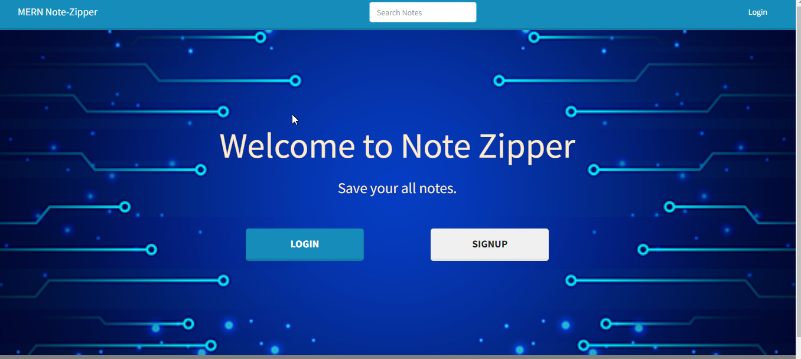

- This app is built wiht MERN Stack 
- For Front-End I have used React-Bootstrap and MaterialUi for designing 
- For backend I have used MongoDB, Nodejs and Express
- For user Authentication I have used JWT token
  

 

